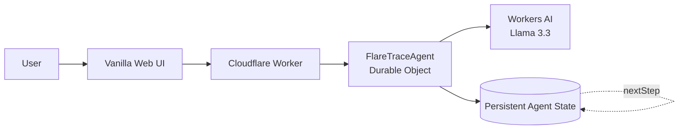

# FlareTrace

FlareTrace is a stateful AI-assisted network troubleshooting application built on Cloudflare.

Its troubleshooting agent, Clara, uses Llama 3.3 through Workers AI to guide users through network diagnosis while maintaining structured incident state across a conversation.

Unlike a stateless chatbot, Clara tracks current connectivity facts, diagnostic evidence, tests performed, hypotheses, and recommended next steps - reconciling new evidence as troubleshooting progresses.

---

## Demo

**Live:** https://flaretrace.georgeet15.workers.dev

---

## Assignment Requirements

| Requirement | Implementation |
|---|---|
| LLM | Llama 3.3 70B via Cloudflare Workers AI (`@cf/meta/llama-3.3-70b-instruct-fp8-fast`) |
| Workflow / coordination | Cloudflare Worker + Agents SDK + Durable Object |
| User input | Vanilla HTML/CSS/JS chat interface |
| Memory / state | SQLite-backed Cloudflare Agent state (persistent across page refresh, isolated per session) |

---

## Architecture



Each browser session generates a UUID. That UUID maps - via `getAgentByName` from the Cloudflare Agents SDK - to one `FlareTraceAgent` Durable Object instance with its own isolated SQLite database. Different sessions produce different instances with no shared state.

---

## How Clara Works

```
User reports evidence
        ↓
Clara interprets it and returns structured JSON
        ↓
Backend merges partial updates onto current incident state
        ↓
Contradictory facts are replaced; fields with no new evidence are preserved
        ↓
Updated state sent to Inspector panel in browser
        ↓
Hypotheses reconsidered; next diagnostic action selected
        ↓
User provides more evidence
```

Clara is instructed to update only the connectivity fields for which explicit evidence exists in the current message. The backend merge layer then:

- Replaces the matching connectivity field (gateway / internetIp / dns) with the new status
- Deduplicates tests by type + target - a repeated test replaces the old result
- Appends new observations (case-insensitive dedup)
- Replaces the hypothesis list entirely each turn (no accumulation of stale hypotheses)

---

## State Model

```
messages
→ full conversation history - multi-turn context for the model

observations
→ notable facts as they were reported - append-only, case-deduped

connectivity
→ current known truth for each node
  gateway:    { address?, status: reachable | unreachable | unknown }
  internetIp: { address?, status: reachable | unreachable | unknown }
  dns:        { status: working | failing | unknown }

testsPerformed
→ latest result per test type + target
  { type, target?, result, summary }
  a repeated test (same type + target) replaces the previous entry

hypotheses
→ current plausible explanations only - replaced in full each turn
  contradicted hypotheses do not survive

nextStep
→ single most useful next diagnostic action
```

This is one of the most important parts of the project. The Inspector panel in the UI makes this state visible to evaluators without requiring code inspection.

---

## Tech Stack

| Layer | Technology |
|---|---|
| Frontend | Vanilla HTML / CSS / JavaScript |
| Backend | Cloudflare Workers (TypeScript) |
| AI | Cloudflare Workers AI - Llama 3.3 70B |
| Agent coordination | Cloudflare Agents SDK |
| Persistent state | Durable Objects (SQLite) |
| Testing | Vitest + `@cloudflare/vitest-plugin` |

---

## Local Development

```bash
npm install
npm run dev
```

Workers AI is accessed remotely even in local dev. You must be authenticated with Cloudflare:

```bash
npx wrangler login
```

The dev server runs at `http://localhost:8787`.

---

## Deployment

```bash
npm run deploy
```

This deploys the Worker, static assets, Durable Object class, and AI binding together via Wrangler. On first deployment, Cloudflare provisions the Durable Object's SQLite database automatically (configured by the `"new_sqlite_classes"` migration in `wrangler.jsonc`).

---

## Example Interaction

**User:**
```
My laptop can ping 192.168.1.1 but cannot ping 8.8.8.8.
```

**Clara:**
```
Your local path to the gateway is working - the problem is beyond the router.
Run: traceroute 8.8.8.8
```

**Inspector updates:**
```
● INVESTIGATING

Connectivity
✓ Gateway (192.168.1.1) - reachable
✗ Internet (8.8.8.8)   - unreachable
? DNS                  - unknown

Possible Causes
· Upstream connectivity issue
· WAN/default-route not configured

Next Step
→ traceroute 8.8.8.8
```

**User:**
```
traceroute to 8.8.8.8
1  192.168.1.1  2 ms
2  * * *
3  * * *
```

**Clara:**
```
Traffic reaches your router but stops there.
Run: check router WAN status and upstream link in the router admin panel.
```

---

## Security and Limitations

- FlareTrace analyzes user-provided text only
- It does not execute shell commands
- It does not SSH into devices
- It does not change network configuration
- It does not replace professional network monitoring systems
- Model-generated hypotheses may be incorrect and should be verified

---

## AI-Assisted Development

AI-assisted coding was used during development, as explicitly permitted by the assignment.

All significant prompts used to build this project are recorded in [PROMPTS.md](PROMPTS.md).

